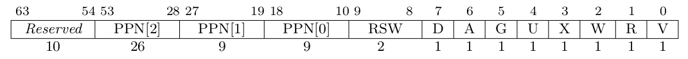

# Chapter 4 实验报告

## 编程作业

重写 sys_get_time 和 sys_trace：现在能在有虚拟内存、跨页情况下正确读写用户内存，并在读/写前做页表和权限检查（不可见或无权返回 -1）。
实现匿名 mmap/munmap：按页分配物理帧并映射到用户虚地址，设置用户访问位（PTE_U），对齐、prot 合法性、重叠或未映射等错误都会返回 -1。

## 简答作业

1. 列举 SV39 页表页表项的组成，描述其中的标志位有何作用？

- [63:54]为保留位, [53:10]这29位为ppn, [9:8]为RSW, [7:0]为标志位.
- ：条目有效（否则视为未映射/缺页）。
- R/W/X：对应读/写/执行权限。
- U：用户态可访问（1：用户可访问；0：仅内核可访问）。
- A：访问位，硬件在访问时置位（常用于页面替换/统计）。
- D：脏位，写时置位（用于写回/换出判断）。

2. 缺页指的是进程访问页面时页面不在页表中或在页表中无效的现象，此时 MMU 将会返回一个中断， 告知 os 进程内存访问出了问题。os 选择填补页表并重新执行异常指令或者杀死进程。

- 请问哪些异常可能是缺页导致的？
  - 读/写/取指访问到未映射或 PTE.V=0 的页会触发页错误, 权限不够（如用户读内核页或写只读页）也可能触发访问异常.
- 发生缺页时，描述相关重要寄存器的值，上次实验描述过的可以简略。
  - stval, 导致异常的指令的虚拟地址
  - scause, 用于区分异常类型
  - satp, 当前页表根

缺页有两个常见的原因，其一是 Lazy 策略，也就是直到内存页面被访问才实际进行页表操作。 比如，一个程序被执行时，进程的代码段理论上需要从磁盘加载到内存。但是 os 并不会马上这样做， 而是会保存 .text 段在磁盘的位置信息，在这些代码第一次被执行时才完成从磁盘的加载操作。

- 这样做有哪些好处？
  - 当引用大量申请内存但实际使用很少时可以减少IO.

其实，我们的 mmap 也可以采取 Lazy 策略，比如：一个用户进程先后申请了 10G 的内存空间， 然后用了其中 1M 就直接退出了。按照现在的做法，我们显然亏大了，进行了很多没有意义的页表操作。

- 处理 10G 连续的内存页面，对应的 SV39 页表大致占用多少内存 (估算数量级即可)？
  - 10GB / 4KB ≈ 2.6 M个页, SV39为3级页表, 每个中间页表包含512个页目录项, 每个叶子页表节点包含512个页表项, 叶级页表叶约为 2.6 M / 512 = 5120 页,中间页面10页, 根页面一页, 共 5131 * 4KB ≈ 20MB.
- 请简单思考如何才能实现 Lazy 策略，缺页时又如何处理？描述合理即可，不需要考虑实现.
  - 在MemorySet中记录虚拟区间和元数据, 不立即分配物理帧或写入PTE
  - 发生缺页中断时, 分配物理帧并填充数据, 设置PTE.

缺页的另一个常见原因是 swap 策略，也就是内存页面可能被换到磁盘上了，导致对应页面失效。
- 此时页面失效如何表现在页表项(PTE)上？
  - 将valid清0, 设置额外的数据结构保存该页在磁盘的位置, 缺页时恢复PTE和物理帧.

3. 为了防范侧信道攻击，我们的 os 使用了双页表。但是传统的设计一直是单页表的，也就是说， 用户线程和对应的内核线程共用同一张页表，只不过内核对应的地址只允许在内核态访问。 (备注：这里的单/双的说法仅为自创的通俗说法，并无这个名词概念，详情见 KPTI )
- 在单页表情况下，如何更换页表？
  - 写satp, 刷新TLB
- 单页表情况下，如何控制用户态无法访问内核页面？（tips:看看上一题最后一问）
  - 将U清0
- 单页表有何优势？（回答合理即可）
  - 系统调用/中断时不用切换页表
- 双页表实现下，何时需要更换页表？假设你写一个单页表操作系统，你会选择何时更换页表（回答合理即可）？
  - 用户态和内核态切换时需要更换页表, 任务切换时也需要.
  - 使用单页表选择任务切换时更换页表, 靠PTE.U控制用户访问.

## 荣誉准则
- 在完成本次实验的过程（含此前学习的过程）中，我曾分别与 以下各位 就（与本次实验相关的）以下方面做过交流，还在代码中对应的位置以注释形式记录了具体的交流对象及内容：
  - 无
- 此外，我也参考了 以下资料 ，还在代码中对应的位置以注释形式记录了具体的参考来源及内容：
  - [rCore-Tutorial-Book 第三版](https://rcore-os.cn/rCore-Tutorial-Book-v3/index.html)
  - [RISC-V 手册](http://riscvbook.com/chinese/RISC-V-Reader-Chinese-v2p1.pdf)
  - [测试用例](https://github.com/LearningOS/rCore-Tutorial-Test-2025S)
- 我独立完成了本次实验除以上方面之外的所有工作，包括代码与文档。 我清楚地知道，从以上方面获得的信息在一定程度上降低了实验难度，可能会影响起评分。
- 我从未使用过他人的代码，不管是原封不动地复制，还是经过了某些等价转换。 我未曾也不会向他人（含此后各届同学）复制或公开我的实验代码，我有义务妥善保管好它们。 我提交至本实验的评测系统的代码，均无意于破坏或妨碍任何计算机系统的正常运转。 我清楚地知道，以上情况均为本课程纪律所禁止，若违反，对应的实验成绩将按“-100”分计。